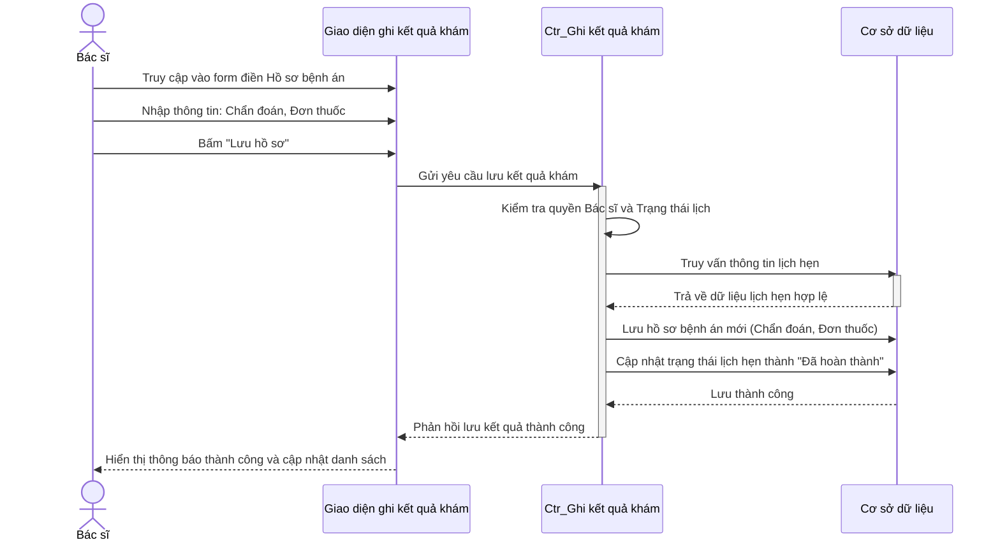
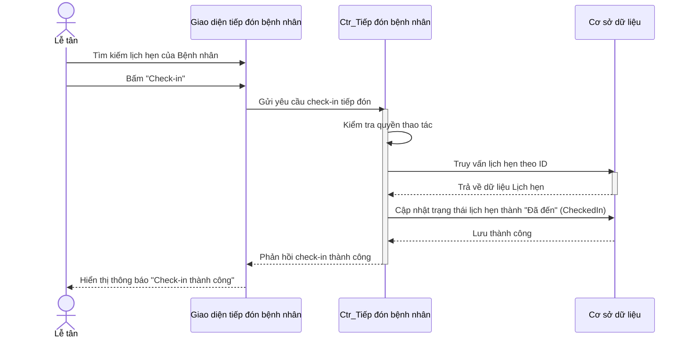
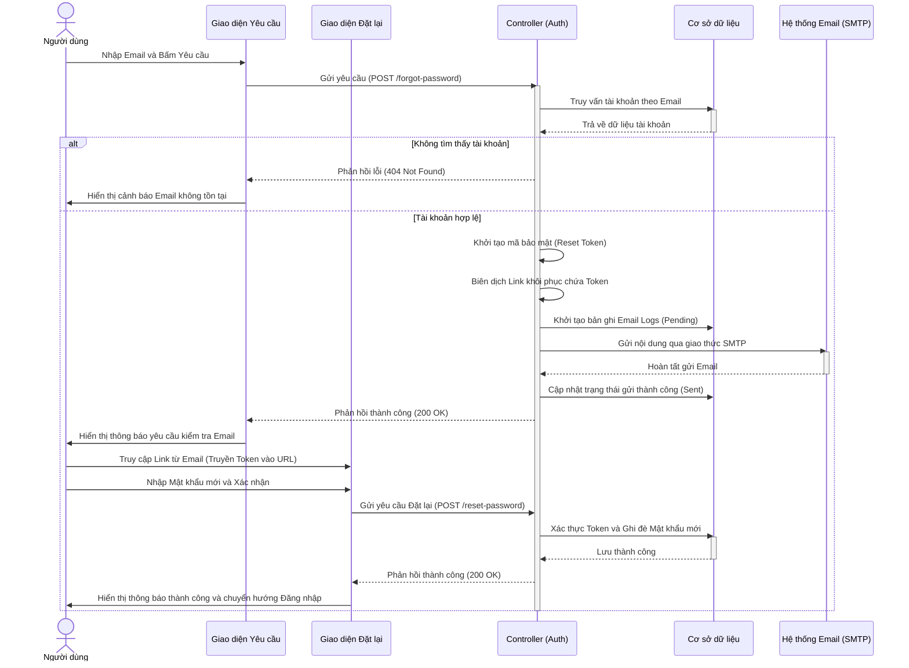

# 1. Biểu đồ tuần tự Ghi kết quả khám (Tạo hồ sơ bệnh án)
**Mô tả nghiệp vụ:** Luồng nghiệp vụ dành cho Bác sĩ. Sau khi khám bệnh xong, Bác sĩ điền thông tin chẩn đoán, toa thuốc và các chỉ định khác. Hệ thống sẽ lưu trữ hồ sơ bệnh án và tự động chuyển trạng thái lịch hẹn của bệnh nhân thành "Đã hoàn thành".

---

# 2. Biểu đồ tuần tự Tiếp nhận bệnh nhân (Check-in bởi Lễ tân)
**Mô tả nghiệp vụ:** Khi bệnh nhân đến phòng khám, nhân viên Lễ tân (Admin/Receptionist) sẽ tìm kiếm lịch hẹn của bệnh nhân đó và bấm nút "Check-in". Ngay lập tức, hệ thống không chỉ lưu vào cơ sở dữ liệu mà còn sử dụng WebSockets (SignalR) để "bắn" thông báo realtime lên màn hình máy tính của Bác sĩ trong phòng khám để bác sĩ biết là bệnh nhân đã có mặt.

*(Lưu ý: Bạn có thể bổ sung thêm phần SignalR Notification nếu cần thiết, tuy nhiên theo source code hiện tại quy trình CheckInAsync xử lý việc đổi trạng thái tại DB, bác sĩ sẽ load lại WaitingList bằng hàm GetDoctorWaitingList)*

---

# 3. Biểu đồ tuần tự Quên mật khẩu (Forgot Password)
**Mô tả nghiệp vụ:** Luồng xử lý khi người dùng (bất kể vai trò) quên mật khẩu. Để đảm bảo tính đơn giản trong phiên bản hiện tại, khi nhập đúng email hợp lệ, hệ thống sẽ tự động cấp và thay thế bằng mật khẩu mặc định (Password@123) mà không cần qua bước gửi email xác thực lằng nhằng. Người dùng sau đó dùng mật khẩu mặc định để đăng nhập và tự đổi lại.

