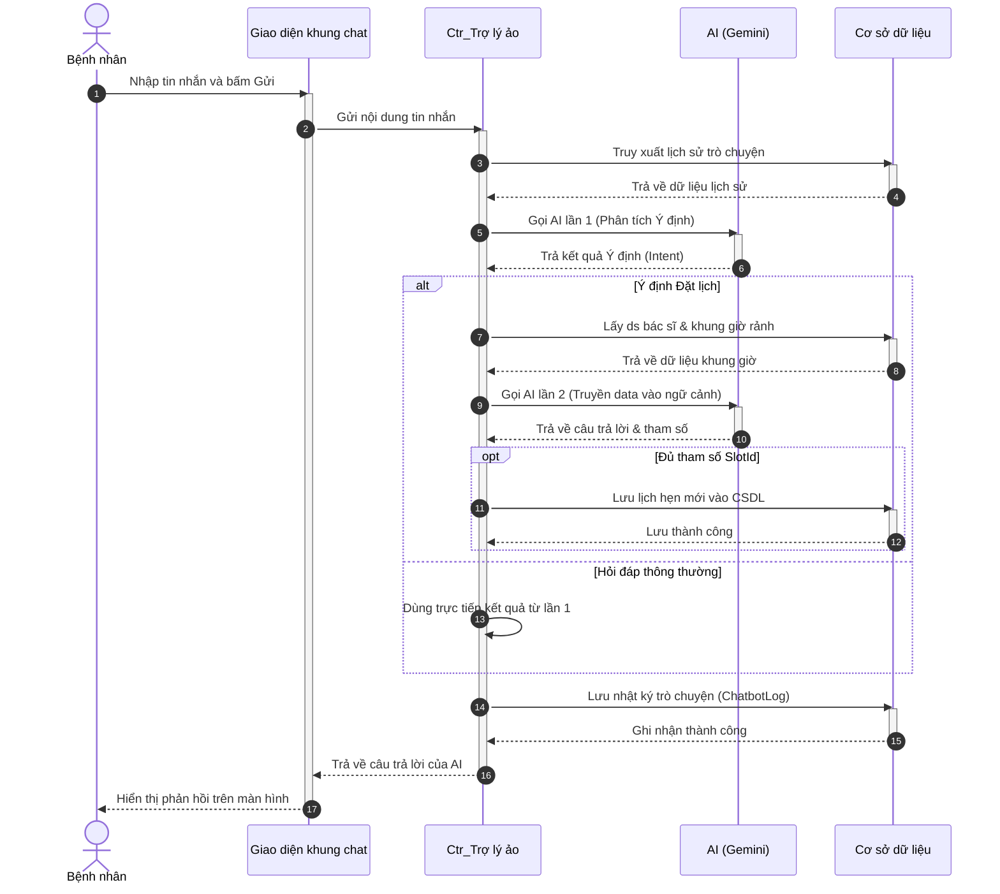

# Biểu đồ tuần tự Tư vấn bằng Chatbot

```mermaid
sequenceDiagram
    autonumber
    actor User as Bệnh nhân
    participant UI as Giao diện khung chat
    participant Ctr as Ctr_Trợ lý ảo
    participant AI as AI (Gemini)
    participant DB as Cơ sở dữ liệu

    User->>UI: Nhập tin nhắn và bấm Gửi
    activate UI
    UI->>Ctr: Gửi nội dung tin nhắn
    activate Ctr

    Ctr->>DB: Truy xuất lịch sử trò chuyện
    activate DB
    DB-->>Ctr: Trả về dữ liệu lịch sử
    deactivate DB

    Ctr->>AI: Gọi AI lần 1 (Phân tích Ý định)
    activate AI
    AI-->>Ctr: Trả kết quả Ý định (Intent)
    deactivate AI

    alt Ý định Đặt lịch
        Ctr->>DB: Lấy ds bác sĩ & khung giờ rảnh
        activate DB
        DB-->>Ctr: Trả về dữ liệu khung giờ
        deactivate DB
        
        Ctr->>AI: Gọi AI lần 2 (Truyền data vào ngữ cảnh)
        activate AI
        AI-->>Ctr: Trả về câu trả lời & tham số
        deactivate AI
        
        opt Đủ tham số SlotId
            Ctr->>DB: Lưu lịch hẹn mới vào CSDL
            activate DB
            DB-->>Ctr: Lưu thành công
            deactivate DB
        end
    else Hỏi đáp thông thường
        Ctr->>Ctr: Dùng trực tiếp kết quả từ lần 1
    end

    Ctr->>DB: Lưu nhật ký trò chuyện (ChatbotLog)
    activate DB
    DB-->>Ctr: Ghi nhận thành công
    deactivate DB

    Ctr-->>UI: Trả về câu trả lời của AI
    deactivate Ctr
    UI-->>User: Hiển thị phản hồi trên màn hình
    deactivate UI
```
